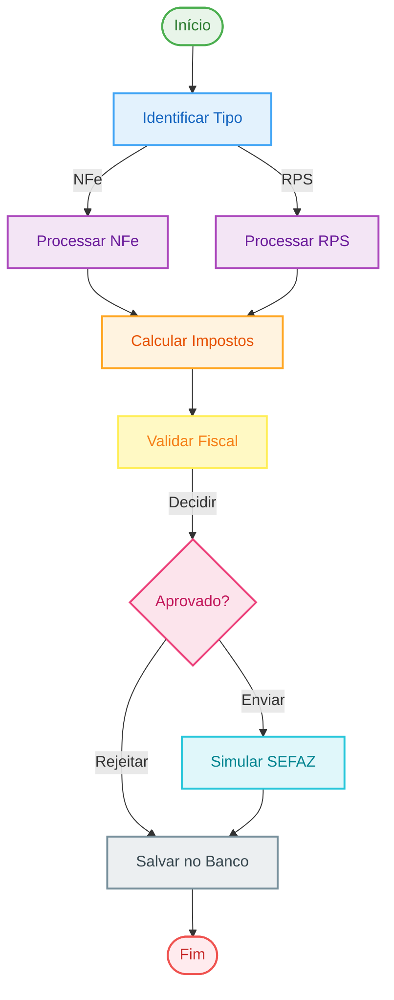

# 📄 NFe Processor Agent

[](https://www.python.org/downloads/)
[](LICENSE)
[](https://streamlit.io/)
[](https://chatgpt.com/)
[](https://pandas.pydata.org/)
[](https://sqlite.org/)
[](https://www.langchain.com/)
[](https://claude.ai/)


Agente inteligente para processamento, validação e simulação de envio de Notas Fiscais Eletrônicas (NFe) e Recibos de Prestação de Serviço (RPS) para homologação SEFAZ, utilizando Inteligência Artificial para validação semântica e enriquecimento de dados.

## 🚀 Características Principais

- 🤖 **Processamento Inteligente com IA**: Utiliza LLMs (Large Language Models) para validação semântica e enriquecimento de dados fiscais
- 📊 **Interface Web Moderna**: Dashboard interativo com Streamlit para visualização e processamento
- 🔍 **Validação Fiscal Completa**: Valida CFOP, CST, NCM, CPF/CNPJ e outros campos fiscais obrigatórios
- 💰 **Cálculo Automático de Impostos**: Calcula ICMS, IPI, PIS, COFINS, ISS e outros impostos automaticamente
- 🏢 **Simulação SEFAZ**: Simula ambiente de homologação SEFAZ para validação prévia
- 💬 **Chat Assistant**: Assistente conversacional para consultas sobre notas fiscais processadas
- 🔄 **Fluxo de Trabalho Inteligente**: Utiliza LangGraph para processamento em workflow automatizado
- 🗄️ **Persistência de Dados**: Banco de dados SQLite para armazenamento e histórico
- 🔌 **Multi-Provedor LLM**: Suporte para OpenAI, Groq, Google Gemini, Claude e Ollama (local)

## 📋 Requisitos

- Python 3.12 ou superior
- [uv](https://github.com/astral-sh/uv) (gerenciador de pacotes Python)
- API Key de um provedor LLM (Groq recomendado para uso gratuito)

## 🛠️ Instalação

1. **Clone o repositório**:
   ```bash
   git clone https://github.com/seu-usuario/nf-processor-agent.git
   cd nf-processor-agent
   ```

2. **Instale as dependências com uv**:
   ```bash
   uv sync
   ```

3. **Configure um LLM de sua preferência** (opcional):
   
   ```env
   Provedor de LLM=Groq
   API Key= sua_api_key
   ```

## 🚀 Uso

### Iniciar a Interface Web

```bash
uv run streamlit run main.py
```

A aplicação estará disponível em `http://localhost:8501`

### Configuração do LLM

1. Na barra lateral, selecione um provedor de LLM (Groq, OpenAI, Claude, Gemini ou Ollama)
2. Insira sua API Key
3. Clique em "Configurar LLM"

**Recomendação**: Use **Groq** para começar - é gratuito e rápido!

### Processar Notas Fiscais

1. Acesse a aba **"📤 Processar"**
2. Faça upload de arquivos XML (NFe ou RPS)
3. Clique em "🚀 Processar Arquivos"
4. Acompanhe o processamento e validação em tempo real

### Dashboard

Visualize estatísticas, gráficos de impostos e relatórios na aba **"📊 Dashboard"**:

- Total de notas processadas
- Notas válidas vs. rejeitadas
- Classificação (Produtos/Serviços)
- Impostos por tipo
- Tabelas detalhadas de notas autorizadas e rejeitadas

### Chat Assistant

Converse com o assistente na aba **"💬 Chat Assistant"** para:

- Buscar notas por número
- Consultar estatísticas gerais
- Obter informações sobre erros
- Fazer cálculos e consultas personalizadas

### Histórico

Consulte e filtre todo o histórico de processamento na aba **"📜 Histórico"** e exporte para CSV.

## 🏗️ Arquitetura

O projeto utiliza uma arquitetura baseada em agentes com LangGraph:



## 📂 Estrutura do Projeto

```
nf-processor-agent/
├── config/
│   └── configuration.py      # Configurações globais
├── data/
│   ├── samples/              # Arquivos de exemplo
│   ├── processed/            # Banco de dados SQLite
│   └── temp/                 # Arquivos temporários
├── logs/                     # Arquivos de log
├── src/
│   ├── agents/
│   │   ├── nf_agent.py       # Agente principal LangGraph
│   │   └── chat_agent.py     # Assistente conversacional
│   ├── api/
│   │   └── simulation_sefaz.py  # Simulador SEFAZ
│   ├── database/
│   │   ├── connection.py     # Conexão SQLite
│   │   └── models.py         # Modelos Pydantic
│   ├── parsers/
│   │   ├── xml_parser.py     # Parser NFe básico
│   │   ├── xml_parser_llm.py # Parser NFe com LLM
│   │   └── rps_parser.py     # Parser RPS
│   ├── prompts/              # Prompts para LLMs
│   ├── tools/                # Ferramentas do agente
│   └── validators/
│       ├── calculators/      # Calculadora de impostos
│       ├── cfops/           # Validador CFOP
│       ├── csts/            # Validador CST
│       ├── ncm/             # Validador NCM
│       └── cpf_cnpj/        # Validador documentos
├── main.py                   # Interface Streamlit
├── pyproject.toml           # Dependências
└── README.md
```

## 🔧 Validações Implementadas

### Validações Fiscais

- ✅ **CFOP (Código Fiscal de Operações)**: Validação de códigos CFOP e correspondência com natureza da operação
- ✅ **CST (Código de Situação Tributária)**: Validação de CSTs de ICMS, IPI, PIS e COFINS
- ✅ **NCM (Nomenclatura Comum do Mercosul)**: Validação de códigos NCM dos produtos
- ✅ **CPF/CNPJ**: Validação de documentos dos clientes e fornecedores
- ✅ **Natureza da Operação (NATOP)**: Validação semântica com LLM
- ✅ **SCT (Situação de Contribuição Tributária)**: Validação de código SCT

### Cálculo de Impostos

- 💰 **ICMS**: Imposto sobre Circulação de Mercadorias e Serviços
- 💰 **IPI**: Imposto sobre Produtos Industrializados
- 💰 **PIS**: Programa de Integração Social
- 💰 **COFINS**: Contribuição para Financiamento da Seguridade Social
- 💰 **ISS**: Imposto sobre Serviços (RPS)
- 💰 **IRPJ**: Imposto de Renda Pessoa Jurídica
- 💰 **CSLL**: Contribuição Social sobre o Lucro Líquido
- 💰 **INSS**: Instituto Nacional do Seguro Social

## 🤖 Provedores de LLM Suportados

| Provedor | Modelos Disponíveis | Status |
|----------|---------------------|--------|
| **Groq** | Llama 3, Llama 2 | ✅ Recomendado (Gratuito) |
| **OpenAI** | GPT-4o, GPT-4o-mini, GPT-4 Turbo | ✅ |
| **Google Gemini** | Gemini Pro, Gemini 1.5 Pro | ✅ |
| **Anthropic Claude** | Claude 3 Opus, Sonnet, Haiku | ✅ |
| **Ollama** | Llama2, Mistral (Local) | ✅ |

## 📊 Recursos da Interface

### Dashboard
- Métricas principais (Total, Valor, Válidas, Erros)
- Gráficos interativos de impostos
- Classificação por tipo (Produtos/Serviços)
- Tabelas detalhadas de notas autorizadas e rejeitadas
- Visualização de erros com detalhes

### Chat Assistant
- Busca de notas por número
- Estatísticas gerais
- Consulta de erros
- Cálculos personalizados
- Histórico de conversação

### Processamento
- Upload múltiplo de arquivos
- Barra de progresso em tempo real
- Validação automática
- Relatórios detalhados

## 🔍 Exemplos de Uso

### Processar uma NFe

1. Faça upload do arquivo XML
2. O sistema identificará automaticamente como NFe
3. Processará e validará todos os campos
4. Calculará impostos automaticamente
5. Simulará envio para SEFAZ
6. Exibirá resultado no dashboard

### Consultar Notas no Chat

```
Usuário: "Quantas notas foram processadas hoje?"
Assistente: "Foram processadas 15 notas hoje, sendo 12 autorizadas e 3 rejeitadas."

Usuário: "Buscar nota número 46492"
Assistente: [Exibe detalhes da nota fiscal 46492]
```

### Estrutura de Logs

Os logs são salvos em `logs/`:
- `app.log`: Logs gerais da aplicação
- `agent.log`: Logs do agente de processamento
- `parser.log`: Logs dos parsers

## 🐛 Troubleshooting

### Erro: "LLM não configurado"
- Certifique-se de inserir uma API Key válida na barra lateral
- Verifique se a API Key está correta para o provedor selecionado

### Erro ao processar XML
- Verifique se o arquivo XML é válido
- Confirme que o arquivo não está corrompido
- Verifique os logs em `logs/` para mais detalhes

### Banco de dados não inicializa
- Verifique permissões de escrita no diretório `data/processed/`
- Execute `init_db()` manualmente se necessário

## 📝 Licença

Este projeto está licenciado sob a Licença MIT - veja o arquivo [LICENSE](LICENSE) para detalhes.

## 👥 Autores

- **Diogo Costa**
- **Martina Froemming**

## 🙏 Agradecimentos

- AgenteFin Group pelo suporte
- Comunidade Streamlit
- LangGraph pela arquitetura de agentes

## 📞 Suporte

Para questões, sugestões ou problemas:
- Abra uma [issue](https://github.com/costadiogo/nf-processor-agent/issues)

---

**⚡ Desenvolvido para facilitar o processamento inteligente de notas fiscais**
